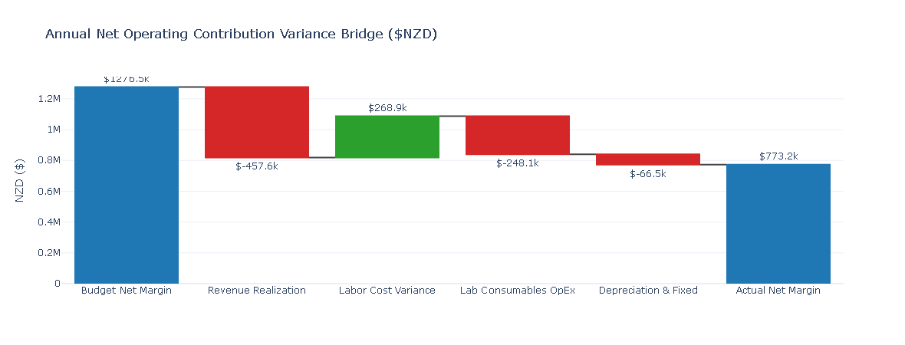
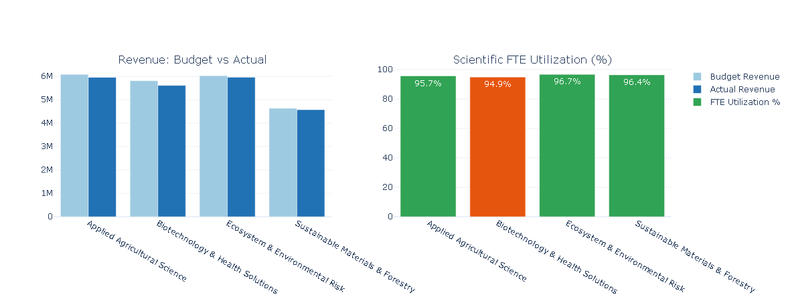

# Research Portfolio FP&A & Grant Performance Engine
### Multi-Year Grant Tracking, FTE Labor Recovery & Automated Executive Variance Analysis

An end-to-end Financial Planning & Analysis (FP&A) engine and decision-support framework designed for research institutes, grant-funded Crown entities, and commercial science portfolios. 

This engine simulates a multi-year research operating model across four scientific divisions, automates milestone-based grant revenue recognition, calculates billable FTE labor recovery versus actual direct costs, decomposes budget-to-actual variances, and programmatically generates plain-language executive advisory briefings for non-financial research leaders.

---

## Executive Dashboards & Performance Visualizations

### Annual Net Contribution Variance Waterfall Bridge
Decomposes total portfolio net margin variance across revenue realization, labor cost fluctuations, laboratory operating expenditures, and fixed depreciation timing.



### Divisional Performance & Scientific FTE Utilization
Evaluates operational revenue delivery and billable researcher utilization across distinct scientific research divisions to detect capacity slippage.



---

## Core Financial Modeling Architecture

1. **Multi-Year Grant Revenue Recognition:**
   - Models milestone-based and straight-line revenue recognition across diverse funding mechanisms (Government Crown Core, Contestable Grants, Commercial Contracts, and International Consortia).
   - Tracks portfolio-level duration schedules and funding burn-down rates.

2. **Direct Labor & FTE Capacity Recovery:**
   - Differentiates direct payroll cost rates from institutional hourly charge-out recovery rates.
   - Decomposes direct labor variance into **Rate Drift** (wage inflation) and **Labor Efficiency/Utilization** (billable scientific hours delivered vs. planned).

3. **Institutional Cost Absorption:**
   - Incorporates laboratory consumable operating expenses (OpEx) with operational volatility modeling.
   - Allocates indirect institutional overheads (18%) and tracks capital expenditure depreciation schedules.

4. **Automated Variance Decomposition:**
   - Calculates primary variances: $\text{Variance} = \text{Actual} - \text{Budget}$ for revenue/margins, and $\text{Budget} - \text{Actual}$ for operational costs.
   - Summarizes divisional performance into key operating ratios: Revenue Realization %, FTE Utilization %, and Net Margin %.

5. **Natural Language Executive Advisory Engine:**
   - Programmatically evaluates divisional health metrics against predefined operating thresholds.
   - Generates structured, plain-language business partnering briefs with specific operational interventions for Science Directors and operational leads.

---

## Repository Structure

```text
├── research_portfolio_fpa_engine.ipynb   # Complete, runnable Google Colab financial engine
├── research_portfolio_gl_data.csv        # 12-month synthetic GL actuals vs. budget dataset
├── division_summary_report.csv           # Consolidated divisional financial performance summary
├── executive_advisory_brief.txt          # Exported automated executive advisory report
├── variance_waterfall_bridge.png         # Plotly net margin waterfall visualization
├── division_performance_dashboard.png    # Plotly divisional revenue & utilization charts
└── README.md                             # Project overview and architecture documentation
